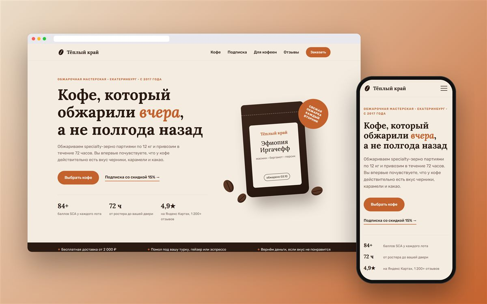
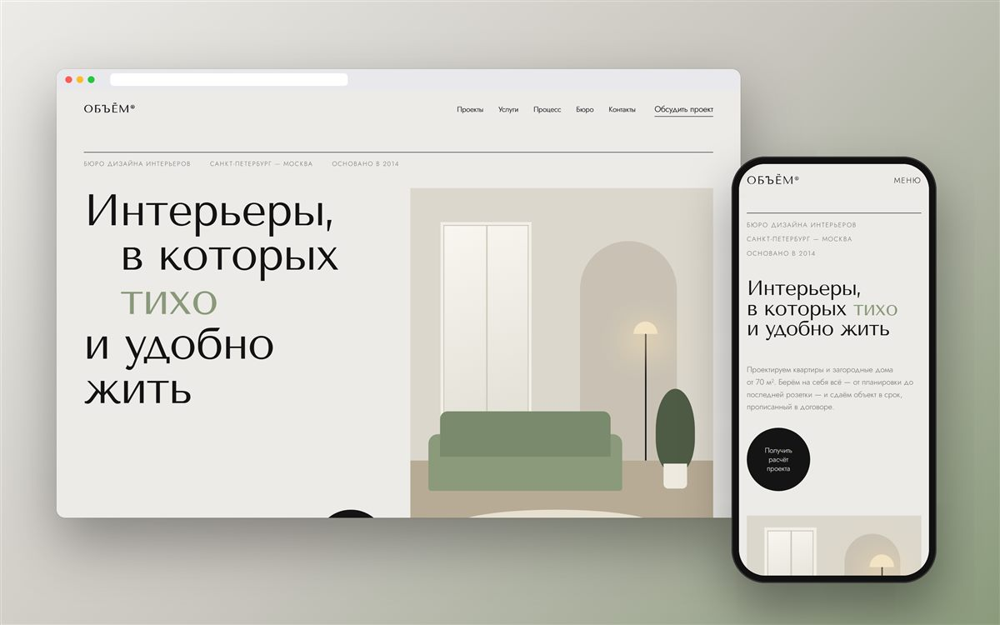
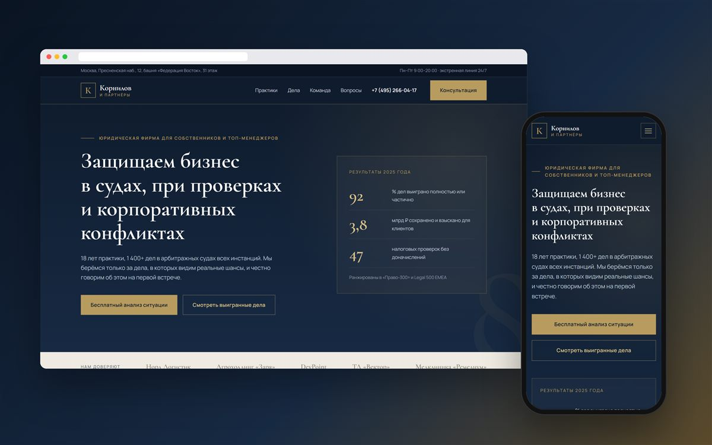
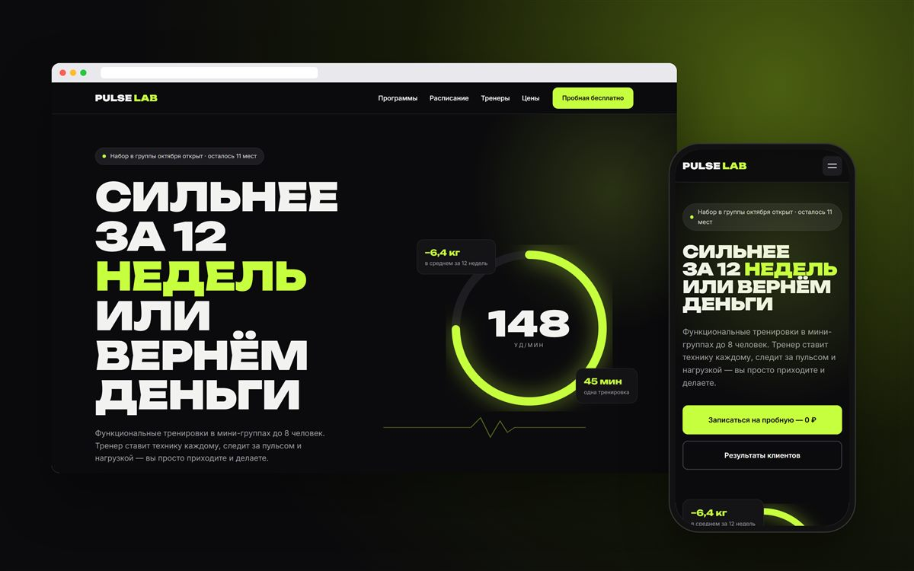
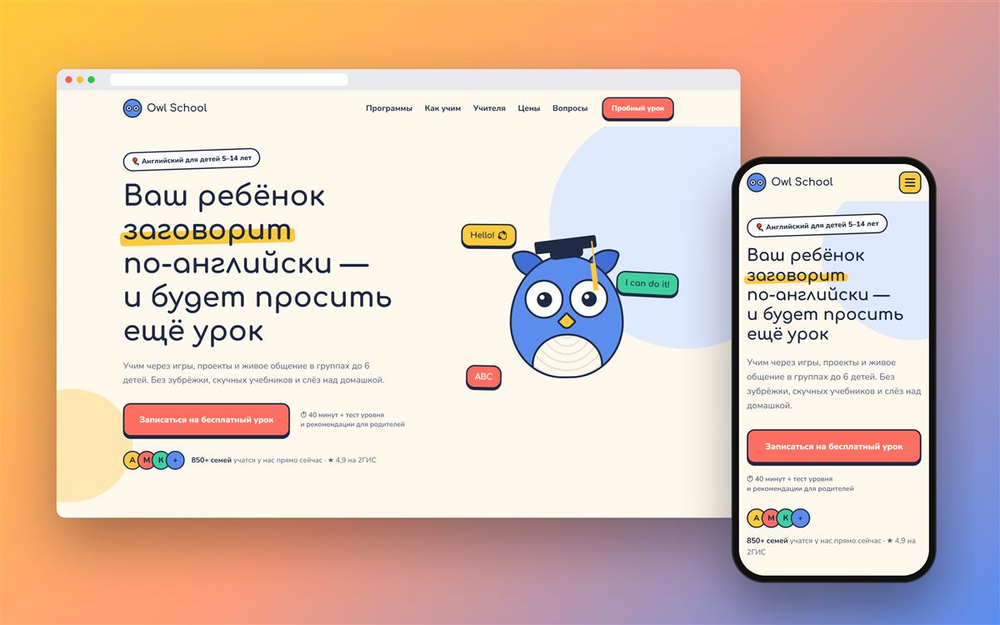
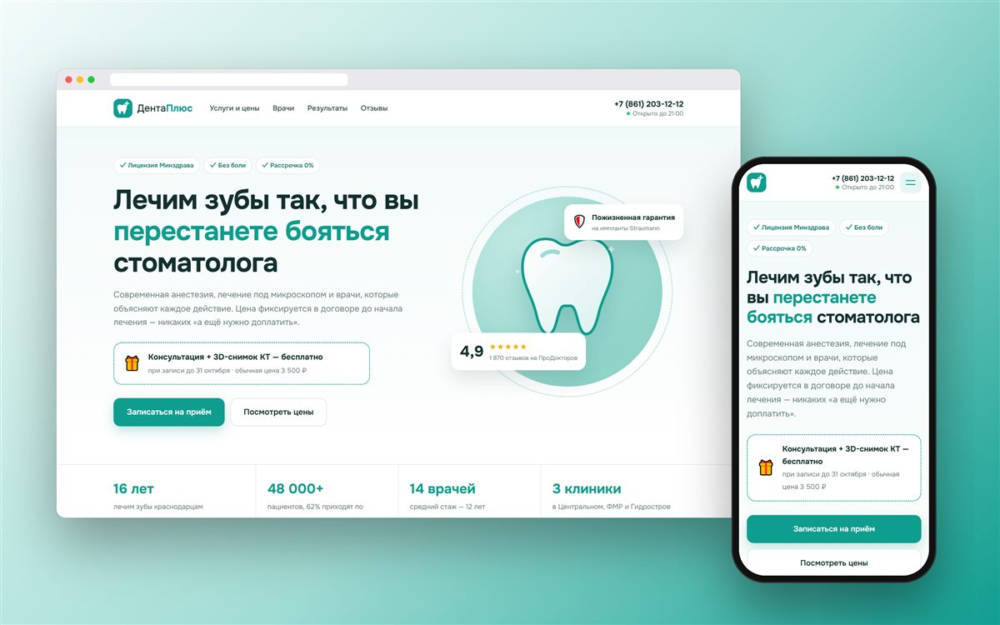
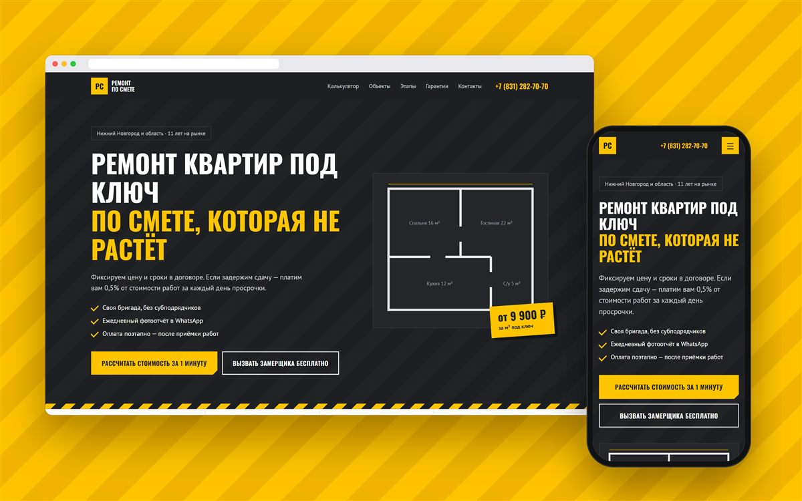
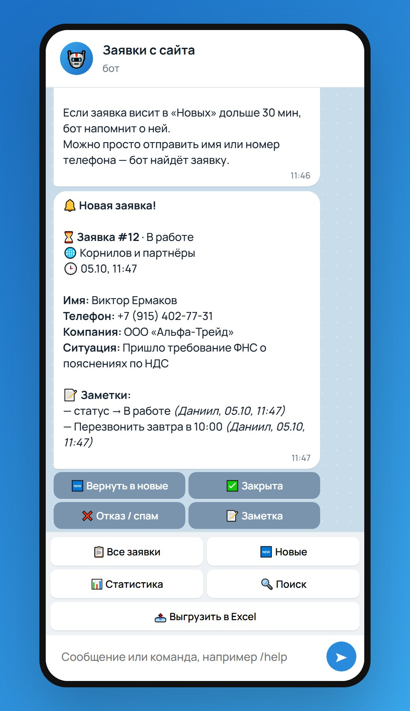
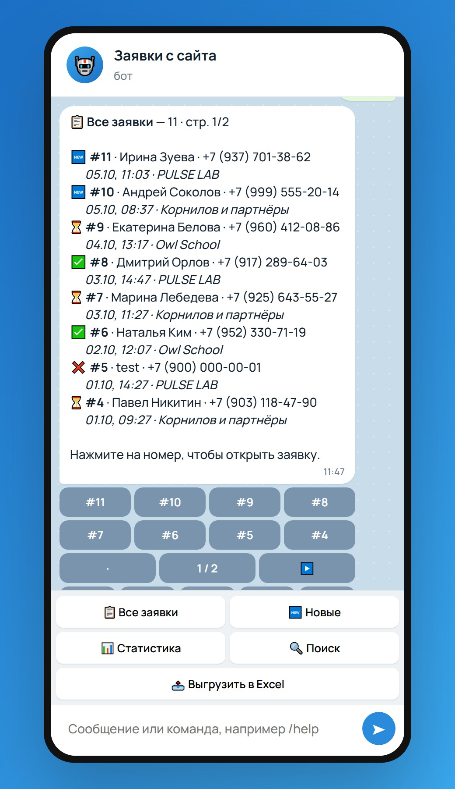
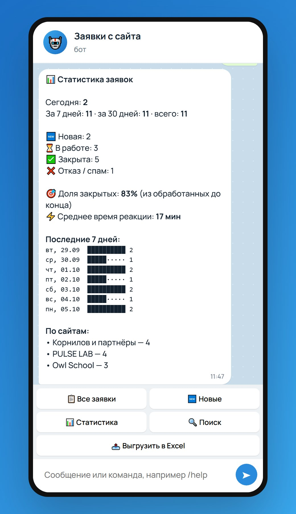

# Портфолио: 

**Витрина:** https://marchenkodanil.github.io/portfolio/

Упаковываю digital-проекты под ключ: **Сайт → Telegram → Контент → Видео → Motion → Соцсети → Реклама**.

Одностраничные продающие сайты для разных ниш. У каждого своя аудитория, визуальная концепция и продающая структура: сильный первый экран, преимущества, подтверждение доверия, примеры работ или услуг, заметная форма заявки. Все сайты адаптированы под телефоны.

| | Сайт | Ниша | Особенности |
|---|---|---|---|
|  | [**Тёплый край**](https://marchenkodanil.github.io/portfolio/01-coffee-roastery/) | Обжарка кофе | Каталог со шкалами вкуса, выбор подписки, раздел для оптовых клиентов |
|  | [**ОБЪЁМ**](https://marchenkodanil.github.io/portfolio/02-interior-studio/) | Бюро интерьеров | Журнальная вёрстка, меню на весь экран, слайдер отзывов |
|  | [**Корнилов и партнёры**](https://marchenkodanil.github.io/portfolio/03-law-firm/) | Юридическая фирма | Анимированные счётчики, раскрывающиеся ответы на вопросы, отправка заявок в Telegram |
|  | [**PULSE LAB**](https://marchenkodanil.github.io/portfolio/04-fitness-studio/) | Фитнес-студия | Расписание по дням, бегущая строка, тарифы |
|  | [**Owl School**](https://marchenkodanil.github.io/portfolio/05-kids-english-school/) | Детская школа английского | Сова из CSS следит за курсором, запись по возрасту |
|  | [**Дента Плюс**](https://marchenkodanil.github.io/portfolio/06-dental-clinic/) | Стоматология | Прайс по вкладкам, слайдер «до/после», маска телефона |
|  | [**Ремонт по смете**](https://marchenkodanil.github.io/portfolio/07-renovation-company/) | Ремонт квартир | Калькулятор стоимости, результат которого попадает в заявку |

## Advertising & Marketing

[Раздел на витрине](https://marchenkodanil.github.io/portfolio/#marketing): рекламные креативы, баннеры, посты для Telegram и соцсетей, концепции кампаний, прогрев и стратегии.

- **4 концепт-кейса:** AI-сервис Neura Copy, онлайн-школа «Пиксель», Telegram-канал «Деньги без паники», цифровой продукт FocusOS. Для каждого: задача, что сделано, стратегия и визуалы.
- **7 рекламных креативов** в форматах 1:1, 4:5 и 16:9 с фильтром по направлениям.
- **6 рекламных постов** в формате Telegram и ВКонтакте.
- **Подход к рекламе:** Анализ → Концепция → Креатив → Тестирование → Масштабирование и 5 типовых стратегий.

Кейсы — концепт-проекты: цифры в них обозначают цели кампаний, а не достигнутые результаты.

## Video Editing и Motion Design

[Раздел на витрине](https://marchenkodanil.github.io/portfolio/#video): интерактивный шоурил с главами, 4 видеокейса (Reels для личного бренда, рекламный ролик, экспертный контент, UI-motion) с превью, которые запускаются при наведении, и 4 motion-демо: кинетическая типографика, анимация логотипа, UI motion, рекламный motion с персонажем.

## Social Media

[Раздел на витрине](https://marchenkodanil.github.io/portfolio/#social): композиция из моков одного бренда (обложка YouTube, профиль Instagram с highlights, Telegram-канал, stories, рекламный пост, аватар и палитра) и 4 кейса оформления: личный бренд, digital-агентство, Telegram-канал, блогер.

Все превью видео, motion и соцсетей собраны на HTML/CSS, без стоковых изображений. Кейсы — концепт-проекты.

## Технологии

- Чистые HTML, CSS и JavaScript: без фреймворков и сборки, каждый сайт открывается сам по себе.
- Все иллюстрации нарисованы на CSS и SVG, сторонних картинок нет.
- Адаптивная вёрстка для компьютеров, планшетов и телефонов, мобильное меню, учёт настройки `prefers-reduced-motion`.
- Валидация форм, скрытое поле-ловушка от спам-ботов.

## Telegram-бот для заявок — [`telegram-bot/`](telegram-bot/)

**[Попробовать демо бота в браузере →](https://marchenkodanil.github.io/portfolio/telegram-bot/)**

  

Node.js без внешних зависимостей. Принимает заявки с сайта по HTTP и даёт работать с ними в Telegram:

- уведомление о новой заявке с кнопками статуса: «В работе», «Закрыта», «Отказ»;
- `/leads` — список заявок с постраничным просмотром и фильтрами, `/new` — необработанные;
- поиск по имени, телефону и тексту, заметки к заявкам;
- `/stats` — статистика, конверсия, время реакции, график за 7 дней;
- `/export` — выгрузка в CSV для Excel;
- напоминания о необработанных заявках, доступ только для администраторов.

Запуск: скопируйте `config.example.json` в `config.json`, укажите токен и свой chat id, затем выполните `node bot.js`.

> На витрине формы работают в демо-режиме. Компании, люди и контакты вымышлены.
