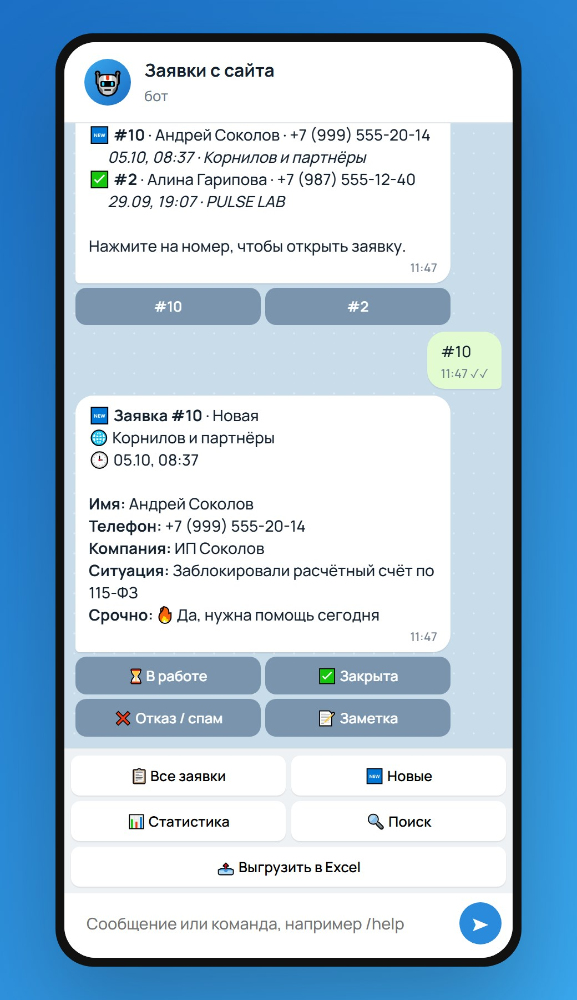
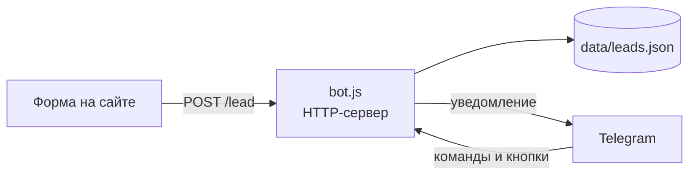

# 🤖 Telegram-бот для заявок с сайта

Клиент оставляет заявку на сайте, и через секунду она приходит владельцу бизнеса в Telegram. Там же заявку можно взять в работу, оставить к ней заметку, найти и посчитать в статистике.

### 👉 [Попробовать демо в браузере](https://marchenkodanil.github.io/portfolio/telegram-bot/)

Демо работает как настоящий бот: те же тексты, кнопки и логика. Можно отправить тестовую заявку, нажимать на статусы, листать список, искать и скачать выгрузку в Excel.

| Новая заявка | Все заявки | Статистика | Поиск |
|:---:|:---:|:---:|:---:|
|  |  |  |  |
| Заявка приходит с кнопками статуса, к ней можно добавить заметку | Список с фильтрами по статусу и постраничным просмотром | Конверсия, время реакции, график за 7 дней, разбивка по сайтам | По имени, последним цифрам телефона, компании или заметкам |

## Что умеет

- 🔔 **Мгновенное уведомление** о новой заявке с кнопками «В работе», «Закрыта», «Отказ / спам» и «Заметка». При смене статуса карточка обновляется во всех чатах администраторов.
- 📋 **Список заявок** с фильтрами (все, новые, в работе, закрытые, отказы) и постраничным просмотром. Нажатие на номер открывает карточку.
- 📝 **Заметки и история**: «перезвонить в пятницу», а смена статуса записывается с именем и временем.
- 🔍 **Поиск** по имени, телефону (достаточно 4 цифр), компании и тексту заметок. Можно просто написать боту текст, а `#12` откроет заявку №12.
- 📊 **Статистика**: заявки за день, неделю и месяц, доля закрытых, среднее время реакции, график по дням, разбивка по сайтам.
- 📤 **Выгрузка в Excel**: вся база файлом CSV, который открывается в Excel без настройки.
- ⏰ **Напоминания**: если заявку 30 минут никто не взял в работу, бот напомнит.
- 🔒 **Доступ только администраторам**: посторонние получают отказ и не видят заявки.
- 🛡 **Защита от спама**: ограничение частоты запросов, проверка полей и скрытое поле-ловушка в форме на сайте.

## Команды

| Команда | Что делает |
|---|---|
| `/leads` | все заявки |
| `/new` | необработанные заявки |
| `/lead 12` | открыть заявку №12 |
| `/find Иван` | поиск по имени, телефону или тексту |
| `/stats` | статистика |
| `/export` | выгрузка в Excel (CSV) |
| `/myid` | узнать свой chat id |

Те же действия доступны кнопками меню под полем ввода.

## Как это устроено

- **Node.js 18+ без внешних зависимостей**: встроенные `http`, `fetch`, `FormData`.
- [`bot.js`](bot.js) принимает заявки по HTTP (с CORS и ограничением частоты), получает сообщения от Telegram через long polling и обрабатывает команды и кнопки.
- [`storage.js`](storage.js) хранит заявки в JSON-файле. Запись атомарная: сначала во временный файл, затем переименование, поэтому файл не повредится при сбое.
- Заявка сохраняется до отправки уведомления: даже если Telegram недоступен, она не потеряется.
- На сайте заявку отправляет [`lead.js`](../03-law-firm/lead.js) ([пример сайта](https://marchenkodanil.github.io/portfolio/03-law-firm/)).

## Запуск

1. Создайте бота у [@BotFather](https://t.me/BotFather) и скопируйте токен.
2. Скопируйте `config.example.json` в `config.json` и укажите `token`.
3. Запустите `node bot.js` (на Windows можно дважды кликнуть `start.bat`), напишите боту `/myid` и добавьте полученный id в `admins`.
4. Перезапустите бота и укажите в настройках сайта `endpoint: 'http://localhost:3000/lead'` (или адрес вашего сервера).

| Настройка | Значение |
|---|---|
| `token` | токен от @BotFather |
| `admins` | chat id тех, кто получает заявки и управляет ими |
| `port` | порт для приёма заявок, по умолчанию `3000` |
| `allowedOrigins` | с каких сайтов принимать заявки; для продакшена укажите свой домен |
| `remindAfterMinutes` | через сколько минут напоминать о необработанной заявке |
| `timezone` | часовой пояс для дат, по умолчанию `Europe/Moscow` |
